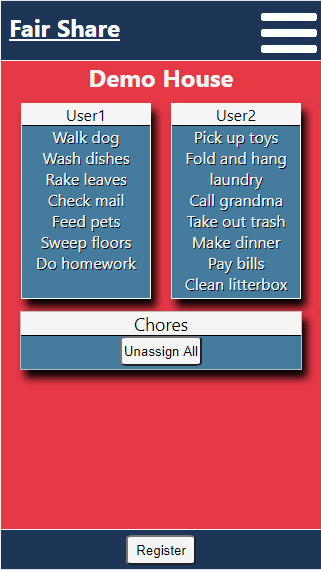
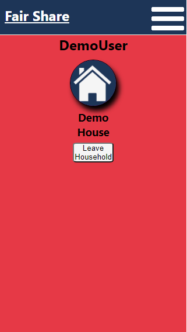
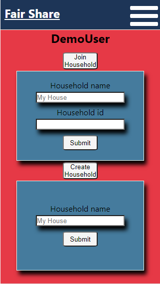
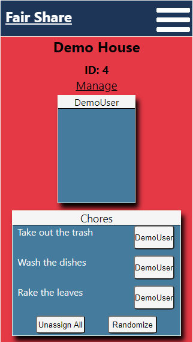
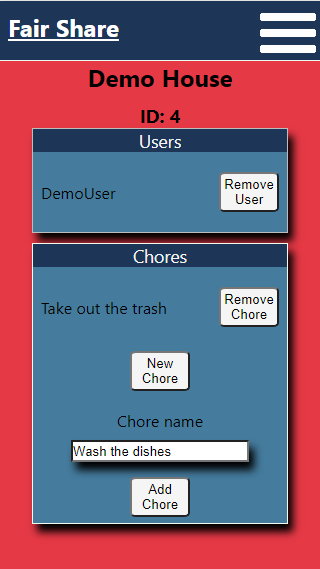
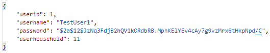
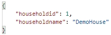
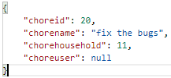

# Fair Share

## Summary
Fair Share is a simple and intuitive platform for organizing and assigning household chores.  Users are able to create a new household or join an existing household created by another user.  Users can generate chores for each household and then assign them to members of that household manually, randomly, or through a combination of both methods.

To demo the application, log in with the username 'DemoUser' and the password 'V3ryS3cr1t!'.

## Live Link
https://fair-share-sigma.vercel.app/

Client repo: https://github.com/KevinPMoore/Fair-Share-Client  
API repo: https://github.com/KevinPMoore/Fair-Share-Server

## Screenshots

### Demo Page

### Userhome Page

### Userhome Page w/Forms

### Household Page

### Manage Page

## API Documentation
### GET api/users/
Returns a list of all user objects.  This is the only api endpoint that does not require authorization from a logged-in account to access.  An example user is below.

### POST api/users/
Adds a user to the database.  The 'username' and 'password' keys are required and the 'userhousehold' is null be default.  The 'password' is hashed upon insertion into the databse.

### GET /api/users/:userid/
Returns the user specified by the 'userid' in the request parameter.

### PATCH api/users/:userid/
Allows for the updating of user object keys.  This is used primarily to update the 'userhousehold' key upon creating or joining a household, or to return it to null when leaving a household.

### DELETE api/users/:userid/
Removes the user specified by the 'userid' in the request parameter.

### GET api/users/:userid/chores/
Returns a list of all chore objects that have a 'choreuser' key that match the 'userid' specified in the request parameter.

### POST api/auth/login/
Generates an authToken and user object when provided with valid login credentials.  This authToken is used to access protected endpoints.  An example response is below.
1[a screenshot of a user object and authToken returned from the API](./ReadMeImages/AuthAPI.png)

### GET api/households/
Returns a list of all household objects.  An example household is below.

### POST api/households/
Adds a household to the database.  The only required key is 'householdname'.

### GET api/households/:householdid/
Returns the household specified by the 'householdid' in the request parameter.

### PATCH api/households/:householdid/
Allows for the updating of household object keys.  While this is supported by the API there is no utility in doing so and this endpoint is not supported in the client.

### DELETE api/households/:householdid/
Removes the household specified by the request parameter.  While this is supported by the API there is no utility in doing so and this endpoint is not supported in the client.

### GET api/households/:householdid/users/
Returns a list of all user objects that have a 'userhousehold' key that matches the 'householdid' specified in the request parameter.

### GET api/households/:householdid/chores/
Returns a list of all chore objects that have a 'chorehousehold' key that matches the 'householdid' specified in the request parameter.

### GET api/chores/
Returns a list of all chore objects.  An example chore object is below.

### POST api/chores/
Adds a chore to the databse.  The only required key is 'chorename'.  The 'chorehousehold' key is determined by the client and the 'choreuser' key defaults to null.

### GET api/chores/:choreid/
Returns the chore specified by the 'choreid' in the request parameter.

### PATCH api/chores/:choreid/
Allows for the updating of chore objects.  This is used in the client to assign and unassign chores from users by altering the 'choreuser' key.

### DELETE api/chores/:choreid/
Removes the chore specified by the request parameter.

## Technologies Used
The front end of this project was built using React and styled with vanilla CSS.
The back end was built with Node and Express while the database uses Postgresql.  The database is connected to the API through the use of Knex.
This project was bootstrapped with [Create React App](https://github.com/facebook/create-react-app).